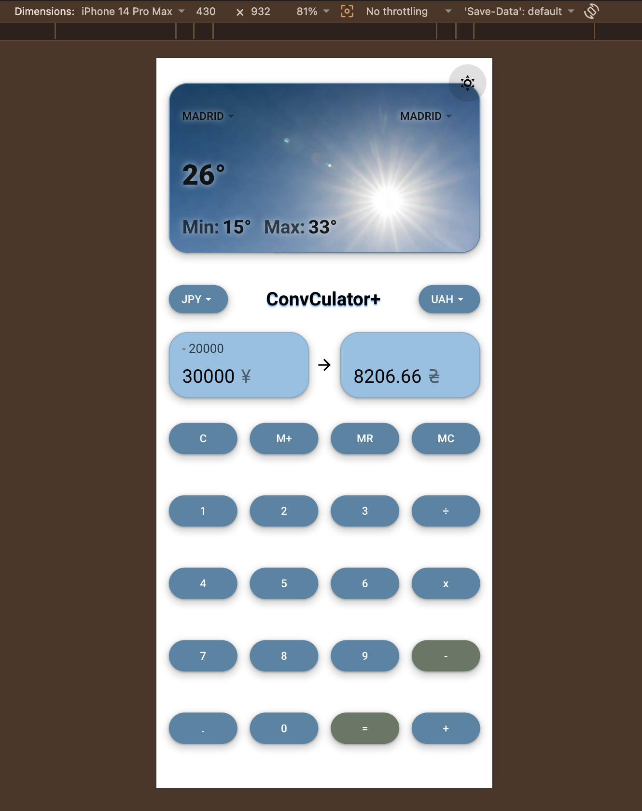
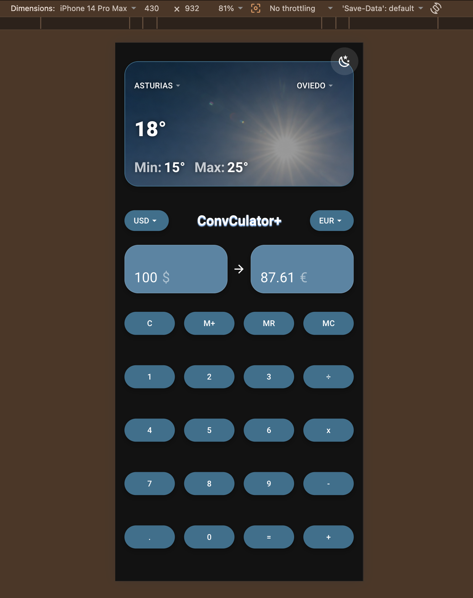
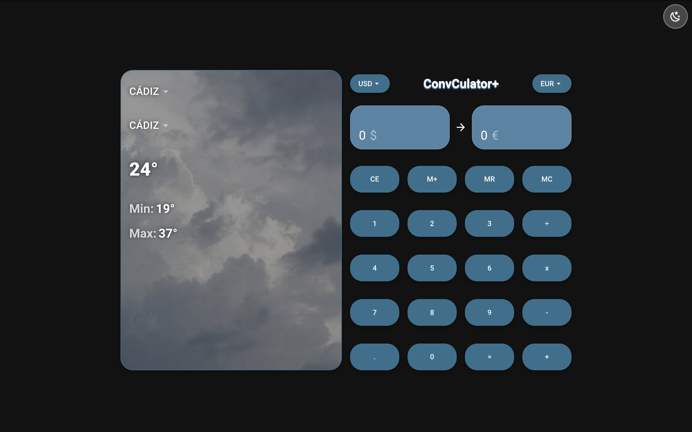
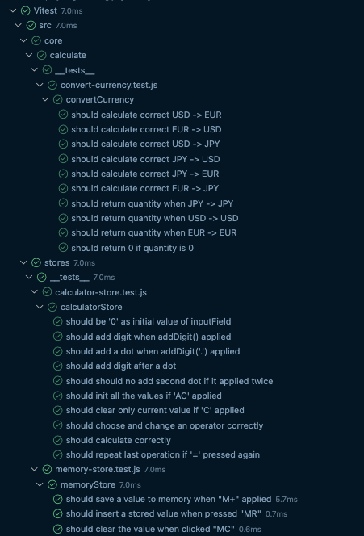
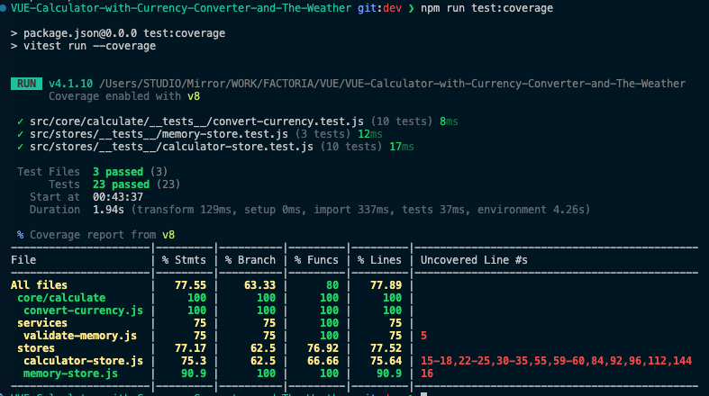
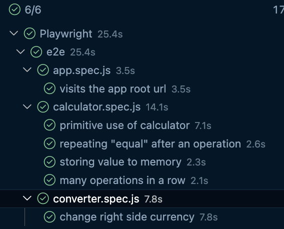

# Factoria F5 - Exercise: VUE Calculator with Currency Converter and The Weather

Go to -> [ConvCulator+](https://danielmuntyanu.github.io/VUE-Calculator-with-Currency-Converter-and-The-Weather/)

## Description:
> A basic Vue app with calculator, currency converter and weather widget. 

> It was made for exercise at Factoria F5 Java Fullstack Bootcamp. 

## Screenshots: 

### Light Theme

### Dark Theme

### Desktop View

## Stack:
- Vuejs
- Tailwind CSS
- Vuetify
- Pinia
- Axios
- node.js
- HTML & CSS
- JavaScript
- Vitest
- Playwright
- GitHub Pages

## Used API: 
- For currency converter: https://currencyfreaks.com/
- For weather check: https://www.el-tiempo.net/api

## Tests

### Unit Tests (Vitest)

### e2e Tests (Playwright)

